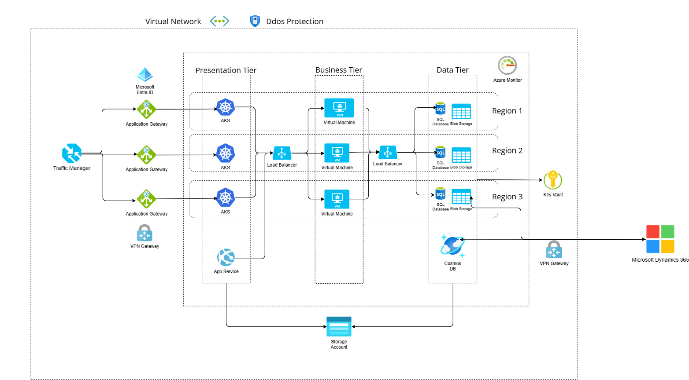

# Introduction

This report provides a detailed migration strategy for the existing infrastructure of GlobalTech Solutions. The report outlines a comprehensive overview of the planned transition to a new cloud-based platform. The report will describe the proposed cloud infrastructure and the step-by-step migration plan using Microsoft Azure. By leveraging Azure's services, GlobalTech Solutions will achieve enhanced scalability, performance, and compliance with international regulations.

## Migration Strategy for SQL Database Cluster on Azure

### High-Level Architecture Diagram

### Migration Phases
### Phase 1: Assessment

#### Virtual Machines
GlobalTech Solutions currently operates 150 virtual machines running a mix of Windows Server and Linux, supporting public-facing e-commerce applications with strict uptime requirements. The primary challenges include rising operational costs, the need for scalable infrastructure to support future growth, and minimizing downtime during migration to avoid disrupting critical services. 

The migration goals are to rehost these VMs to Azure using Azure Migrate, improve the performance and reliability of e-commerce applications, ensure compliance with international regulations such as GDPR and HIPAA, and reduce operational costs through Azure's pay-as-you-go model. Given the legacy nature of some VMs and applications, refactoring them to better leverage cloud-native features could further enhance scalability and performance.

#### ERP System Assessment
During the assessment for the ERP system, we will assess and understand the current on-premise ERP system, document the ERP system components, integrations, dependencies, and configurations. The current monolithic ERP system contains all of its modules/business functions in one single application, and most likely share the same database. Understanding how these components interact with each other and with other systems will allow the company to carefully plan for a smooth migration, reducing potential risks and downtown. The company will also decide what services are no longer needed, and what services they want to keep, expand and/or grow. Another key task is evaluating the current performance to ensure that the new ERP system can match or exceed it.

Additionally, it is essential to define GlobalTech Solutions’ business goals, which involves determining which services and modules should be retained. What is the company’s main focus or motivation for this migration? Scalability, flexibility, cost-effectiveness, innovation, expansion, compliance?

#### <ins>Public-facing e-commerce Application</ins>

<ins>Overview of component</ins>

The public-facing e-commerce application is the front-end of the company that the customers will be faced with when interacting with the system. This application is assumed to have functions such as product inventory, checkout, etc. When migrating to the cloud, strict uptime, scalability and disaster recovery capabilities to support future growth are requirements.

<ins>Current State of the System</ins>

Currently the application operates as a monolithic application that is hosted on the on-premises virtual machines. Using Azure Migrate, we can identify the dependencies that the application may have such as a dependency on the in-house SQL database.

<ins>Challenges of Current System</ins>

Due to the monolithic design of the application, the requirements that the company requires have already failed. Scalability is not feasible due to the design of the application being unable to handle traffic spikes,and fault tolerance fails due to the nature of a monolithic system and how it brings down the entire application since isolation of a failure is not possible.

<ins>Migration Goals</ins>

By breaking down the application into microservices, containerizing them with Docker and orchestrating them using Azure Kubernetes Service (AKS), the requirements of the company are met. Transitioning to a microservice architecture enables independent scaling of the components that will be in high-demand during traffic spikes fulfilling the scalability requirement. Also through leveraging AKS, we can utilize multiple clusters and geo-redundancy to ensure the strict uptime requirements are met. Furthermore, since each microservice can be isolated, if one service fails, it can be isolated and fixed without taking down the entire system.

#### SQL Database Cluster
During the assessment for the SQL database cluster, we will use Azure Migrate Database Assessment tool to:
1. Analyze the compatibility of the current SQL database schema and data with Azure SQL Managed Instance.
2. Identify dependencies on legacy systems and connected applications.
3. Estimate the data size and identify performance bottlenecks.

### Phase 2: Planning
The table below shows the timeframe required for each task in the planning phase. The tasks can run concurrently, but the total duration is approximately 8-14 weeks

1. Shortest Possible Duration: 7 weeks (if all tasks are done in parallel and without delays)
2. Longest Possible Duration: 14 weeks (considering potential overlaps and delays)

| **Component**                          | **Task**                         | **Estimated Time** |
|----------------------------------------|----------------------------------|--------------------|
| **Rehosting using Azure Migrate**      |                                  |                    |
|                                        | Assessment and Planning          | 1-2 weeks          |
|                                        | Replication and Migration        | 2-4 weeks          |
|                                        | Testing and Validation           | 1-2 weeks          |
|                                        | **Total Estimated Time**         | **4-8 weeks**      |
| **ERP System (Microsoft Dynamics 365)**|                                  |                    |
|                                        | Planning and Setup               | 2-4 weeks          |
|                                        | Data Migration                   | 2-4 weeks          |
|                                        | Configuration and Customization  | 2-4 weeks          |
|                                        | Training and Go-Live             | 1-2 weeks          |
|                                        | **Total Estimated Time**         | **7-14 weeks**     |
| **SQL Database**                       |                                  |                    |
|                                        | Assessment and Planning          | 1-2 weeks          |
|                                        | Data Migration                   | 2-4 weeks          |
|                                        | Testing and Optimization         | 1-2 weeks          |
|                                        | **Total Estimated Time**         | **4-8 weeks**      |
| **Mainframe System**                   |                                  |                    |
|                                        | Assessment and Planning          | 2-4 weeks          |
|                                        | Rehosting and Migration          | 4-6 weeks          |
|                                        | Testing and Validation           | 2-4 weeks          |
|                                        | **Total Estimated Time**         | **8-14 weeks**     |

#### ERP Migration Planning
1. Decide on migration strategy
  - We have decided that a replace/refactor strategy best suits this company’s goals as the monolithic ERP system is nearing the end of their support. This will make it difficult to use and maintain in the future, especially with the modules under one application and sharing a single database. Bug fixes and adding additional features, changes to the services will most likely require changes to the whole application, which will be time consuming and costly. Thus, using a cloud ERP system will be most suitable as it is fast, reduces capex expenditures, and reliable.

2. Plan the migration
  - We will have to look at the current system and pinpoint key services that the company will need, as well as dependencies on other services. This helps the company pick a suitable cloud ERP provider as well as an appropriate migration approach. We have decided on incremental migration as it is less disruptive, flexible, and is easier for testing and validation. 

#### SQL Database Cluster
1. Select Target:
    - For GlobalTech Solutions, we concidered to do refactoring its applications to adopt microservices or modern architecture. In this case, we decided to use Use Azure SQL Database.
2. Define Migration Methodology:
    - For minimal downtime, use Azure Database Migration Service (DMS) in online migration mode.
    - Plan a fallback strategy in case of migration issues.
3. Compliance Planning:
    - Use Azure Policy to enforce GDPR/HIPAA compliance.
    - Enable Transparent Data Encryption (TDE) for data-at-rest.
4. Network and Access Configuration:
    - Plan VNet Integration and Firewall Rules for secure connectivity.
    - Enable Azure Active Directory Authentication for secure user access.

### Phase 3: Execution

#### ERP System
1. Data Migration
  - Move data from the old ERP system to the new SaaS system
    -   Data cleansing and transformation
2.  Prepare the cloud environment
  - Set up the desired modules on the SaaS system based on business needs
3. Integrate with other systems
  - Configure and integrate so that other services (such as Azure services) can communicate with the new ERP system
4. Testing
  - Perform tests for functionality, performance and security

#### SQL Database Cluster
1. Backup and Pre-Migration Testing:
    - Take a full backup of the SQL database and test it for corruption or inconsistencies.
2. Migration Execution:
    - Configure Azure Database Migration Service to migrate the database.
    - Monitor progress and validate intermediate stages.
3. Performance Testing:
    - Conduct performance benchmarking to compare pre- and post-migration performance.

#### Phase 4: Validation

### Recommendations for Tools and Services
**Azure Migrate**: Assess dependencies and readiness for migration to Azure. Discover and assess on-premise workloads, and the suitability of moving workloads to the cloud\
**Azure Advisor**: A free tool that provides best practices to optimize cost, security, and performance\
**Azure Site Recovery**: lift existing e-commerce platform to VMs to gradually modernize it\
**Azure Kubernetes Service**: Orchestrate the microservices\
**Azure Database Migration Service (DMS)**: For schema and data migration.\
**Azure Monitor**: For tracking performance metrics post-migration.\
**Azure Key Vault**: For securing encryption keys.

### Address Legacy System Modernization

#### Payroll & Report System Modernization

To address the legacy payroll system, we must first make some assumptions about the current architecture.

What we know: 
- The legacy system is used for employee payroll and reporting.
- The system is reaching the end of its support lifecycle.

The current architecture could be:

**Hardware**

1. Mainframe server: The server could be centralized, largely scaled and have high performance for a multinational company. IBM Z Series can be used to handle the requirements needed for a payroll and reporting system (high volumes & traffic of data processing) and is standard with legacy systems.

2. Storage: Storage Area Networks (SAN) could've been sed to store the data. It offers data redundancy and failover mechanisms, which can be great when dealing with payrolls to not cause any errors with the customer and miss any costs/overcost.

3. Backups/Archive: Tape drives were often used to archive data and serve as a backup, as they are cost effective and reliable for an on-prem solution.

**Software**

1. Operating System: Linux OS could've been used and is the industry standard, and offers strong features such as the extensive libraries and development tools, and easily integrates with containerization services and virtual machines.

2. Payroll Application: For the application that handles payrolls, GlobalTech likely uses their own developped application through the company, hosted on a legacy computer.

3. Database: SQL Database is the reliable way to handle the data and it is compatible with most systems, and easily migratable or scalable.

To visualize the architecture of the legacy system, we have a concept diagram of it.

Migrating to Azure

Tools to be used:
Azure Migrate for the VMs
Azure DMS for the database
AzCopy to copy the Storage

1. PayrollAppService: For the PayrollAppService, we can refactor and migrate the software into an Azure App Service to handle payrolls and reports while also offering the user interface platform for employees.

2. Database: The database can be migrated to an Azure SQL Database. This offers many features and reduces admin requirements, while still being fully managed. 1 Database with geo-redundant storage

3. Storage: For storage, we can migrate from the SAN to the Azure Blob Storage. It offers features such as the storage tiers, lifecycle management and integration with other Azure services.

4. Backups/Archive: For backups/archives, we can use Azure Backup. Azure Backup is great because it can seamlessly interact with Azure Blob Storage and the database without any infrastructure management, which makes migration even easier.

#### ERP System Modernization
For the legacy monolithic ERP system, we have decided to replace/refactor the system with a cloud based ERP system. The legacy ERP system has numerous issues that make it increasingly difficult to continue using. The legacy ERP system is nearing the end of its support, this means that the vendor will no longer provide updates, patches, nor technical support for that system version. 

This may cause significant issues as GlobalTech Solutions will no longer be getting new features and updates essential for the company’s expansion and growth. The system will be unable to integrate with possible newer technologies or services. This also presents a significant security risk, as staying current with the latest security practices is crucial.

Another thing to look at is the monolithic design. This is problematic as the different business management products (including financial and inventory management) are tightly coupled. Any change in one part of the system will often require changes in other parts, making it more difficult to add new features or any other changes, reducing its ability to scale. 

There are a couple of options to migrate this system: replace with PaaS, replace with SaaS, or replace with a custom-built ERP system. PaaS and custom-built offers more control and customization, however, the objectives of the migration include minimizing operational disruption, supporting scalability and modernization. PaaS and custom-built options require a significant amount of effort, time and expertise; the company may have to acquire more resources, funding, and IT staff with the knowledge to build and/or maintain ERP systems. Whereas the SaaS options are ready to use without the need to download or configure any core functionalities. SaaS vendors take care of all the maintenance, updates and patches. This option is also cost effective as SaaS services are usually subscription-based; pay per-user, per-month basis. Additionally, the SaaS ERP system handles scalability and security, ensuring smooth growth and protection. 

For these reasons, we think it would be best to replace this with a cloud-based version (SaaS). Cloud-based ERP systems such as NetSuite and Microsoft Dynamics 365 are hosted and managed by the provider. SaaS provides faster deployment, cost-effectiveness, and low maintenance. 
“The cloud provider patches, manages, and updates the software several times a year—rather than an expensive upgrade every 5 to 10 years with an on-premises system. The cloud can reduce both operational expenses (OpEx) and capital expenses (CapEx) because it eliminates the need for companies to purchase software and hardware, or hire additional IT staff” (What is Erp?). 

The company would first have to evaluate its current ERP system, its configurations, integrations and dependencies. A good SaaS option for this migration is Microsoft Dynamics 365, as it is owned by Microsoft so it can easily be integrated with Azure resources and services. After choosing which services/modules to use from Microsoft Dynamics 365, the company would have to refactor the databases so that each microservice has its own database, following the twelve-factor methodology. This ensures faster deployment, flexibility, fault isolation, reduced downtown, and fewer bottlenecks. Following the incremental migration strategy, a small part of the system will be transferred to the SaaS ERP system, integrations with dependencies will be tested and then deployed. This will be the process until the entire ERP system has been successfully migrated. 

### Cost Estimation
3-Year reserved and Azure hybrid for everything

#### Virtual Machines
- 50 vms - 20 Canada central, 20 Sweden central, 10 south east Asia 
- linux
- d2s v3, 8GB ram

#### ERP system 
3 micro services: 
- microsoft dynamics 365 supply chain management: 
- microsoft dynamics 365 finance: 210/user
- microsoft dynamics 365 intelligent order management: 

#### Payroll and Reporting System
Web App Services: 1
- Canada central
- Tier: standard
- Instance: S2

#### E-commerce Applications
AKS:
- 3 clusters: high availability, failover
- D4AS standard
- vm 4-5 linux
- tier: standard

#### Database:
- 9 sql database: 2 (ERP) + 5(e-commerce applications) + 1 (customer and operational data)
    - one for each micro services, It is the best practices and recommended to avoid bottleneck
    - Bussines critical
    - stanand Series Gen5
    - 8v cores
    - geo replica
    - Geo redundancy
    - storage data 32GB  
- 2 cosmos db: ERP + payroll
    - multi-region: Canada central, Sweden central, south east Asia
- 1 general storage account for everything else: Sweden central
    - blog storage
    - standrad
    - geo-redandunt
    - 1TB
    - 3y reserved

#### Security and Monitoring
- Azure Monitor:
    - Sweden central
- Vnets 2:
    - Sweden central ->Canada central, Sweden central -> south east Asia
- load balancer 3: 
    - Sweden central, Canada central, south east Asia
    - tier: standard
- Application Gateway 3: 
    - Sweden central, Canada central, south east Asia
    - standard v2
- VPN gateway 3: 
    - Sweden central, Canada central, south east Asia
    - basic vpn
- Traffic Manager
    - Canada central
    - 3 endploints
- Retention Policy
    - 1 interactive retention - default
    - 31 days - free
- DDos
    - Canada central
    - Tier:network protection

#### Migration Tool:
- Azure Migrate - free
- Azure database Migration services - free
    - Canada central
    - standard

**Total $44,532.92**

### Compliance and Security
- Disaster Recovery:
    - Configure Azure SQL Geo-Replication for high availability and disaster recovery.
    - Regularly test failover scenarios.
- Regulatory Compliance:
    - Use Azure Compliance Manager to manage compliance requirements like GDPR and HIPAA.